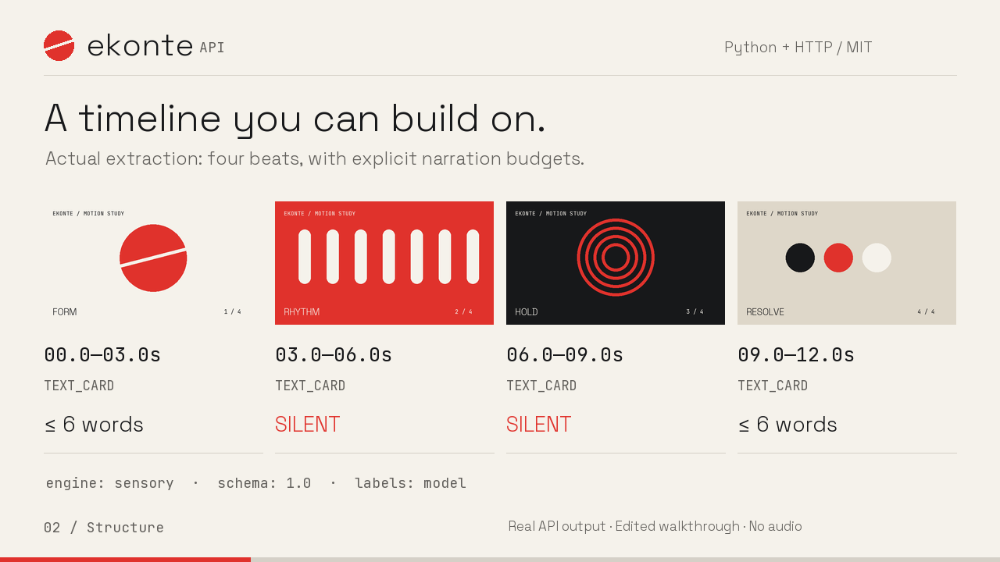

# Demo: one reference, two new briefs

[](https://github.com/shiki4709/ekonte-api/blob/main/docs/assets/ekonte-demo.mp4)

**[Watch the 36-second MP4](https://github.com/shiki4709/ekonte-api/blob/main/docs/assets/ekonte-demo.mp4)** · [Animated preview](assets/demo-preview.gif) · [Original 12-second reference](assets/reference.mp4)

This is an edited walkthrough visualizing **real API outputs**, not a real-time screen recording. The reference is an original geometric motion study created for this repository. The demo has on-screen explanations and no audio. Timings are presentation timings, not latency measurements.

## What you see

| Time | Step | Evidence |
|---|---|---|
| 00:00–00:06 | Original reference video | [reference.mp4](assets/reference.mp4) |
| 00:06–00:14 | Four timed beats; narration budgets `6, 0, 0, 6` | [analysis.json](demo-data/analysis.json) |
| 00:14–00:22 | Reuse that analysis for a fictional motion studio and Ekonte | [Studio plan](demo-data/studio-plan.json), [developer plan](demo-data/developer-plan.json) |
| 00:22–00:30 | Add speech to the second beat (ID `1`, 03–06s); the validator reports `silent_beat` | [Validation evidence](demo-data/validation.json) |
| 00:30–00:36 | Installation and offline analysis | [Quick start](../README.md#quick-start) |

Both captured plans contain zero pacing violations. That demonstrates the constraints on this example; it is not a quality benchmark. The two briefs explicitly specify their opening and closing lines. Ekonte generates the production actions, overlays, and sound directions around those instructions. The capture used Gemini 2.5 Flash; [capture metadata](demo-data/capture.json) records the briefs and actual provider-call counts.

## Captions and transcript

- [English captions](assets/demo.en.vtt)
- [日本語字幕](assets/demo.ja.vtt)
- [简体中文字幕](assets/demo.zh-CN.vtt)

GitHub's file preview may not load separate caption tracks. Download the MP4 and a VTT file for a player that supports external subtitles, or read the transcript below. The on-screen English explanations are included in the video itself.

### English

**00:00** Keep the structure. Change the story. Ekonte turns a reference video into reusable beats and new production plans.

**00:06** This twelve-second synthetic reference produces four three-second beats. Its sensory classification assigns narration budgets of six, zero, zero, and six words.

**00:14** Reuse the same Analysis JSON for two briefs: a fictional motion studio and an introduction to Ekonte. Both plans preserve the two silent middle beats.

**00:22** Deliberately add a spoken line to the second beat (ID 1, 03–06s). The deterministic validator reports a silent-beat violation without making an AI call.

**00:30** Install from GitHub. Python 3.11 and FFmpeg are required. Offline extraction needs no API key; Gemini-powered analysis and generation use your own key.

### 日本語

**00:00** 構成を活かして、新しいストーリーへ。Ekonteは参考動画を再利用できるビートに分解し、新しい制作プランにつなげます。

**00:06** この12秒の合成サンプルは、3秒ずつの4ビートに分かれます。sensory分類の方針により、ナレーションの語数上限は順に6、0、0、6になります。

**00:14** 同じAnalysis JSONを、架空のモーションデザインスタジオとEkonteの紹介という2つの制作指示に使います。どちらも中央の2ビートは無言のままです。

**00:22** 2番目のビート（ID 1、03〜06秒）に意図的にセリフを追加します。検証関数はAIを呼び出さずに、無言ビートの制約違反を検出します。

**00:30** GitHubからインストールできます。Python 3.11以上とFFmpegが必要です。オフライン抽出にAPIキーは不要です。Geminiによる解析と生成には自分のキーを使います。

### 简体中文

**00:00** 保留结构，创作新故事。Ekonte把参考视频拆解为可复用的节拍，再生成新的制作方案。

**00:06** 这段12秒的合成示例被拆成四个3秒节拍。按照sensory分类的旁白策略，字词数量上限依次为6、0、0、6。

**00:14** 将同一份Analysis JSON用于两份创作要求：虚构的动态设计工作室，以及Ekonte介绍。两个方案都保留了中间两个无旁白节拍。

**00:22** 故意给第二个节拍（ID 1，03–06秒）添加一句旁白。确定性校验器无需调用AI，就能报告无旁白节拍的约束违规。

**00:30** 从GitHub安装，需要Python 3.11及以上版本和FFmpeg。离线提取无需API密钥；Gemini分析和生成使用你自己的密钥。

## Reproduce

```bash
pip install -e '.[gemini]' pillow
# Rendering the saved evidence makes no model calls:
python scripts/render_demo.py

# Optional: regenerate the reference and capture fresh model outputs.
# This uses your provider account and model outputs can vary.
export GOOGLE_API_KEY='your-key'
python scripts/capture_demo.py
python scripts/render_demo.py
```

The reference, renderer, and presentation assets are original project material. Fonts are Space Grotesk and JetBrains Mono, distributed with their SIL Open Font License files in [assets/fonts](assets/fonts). The logo is the existing Ekonte wordmark. See [asset provenance](assets/README.md).
