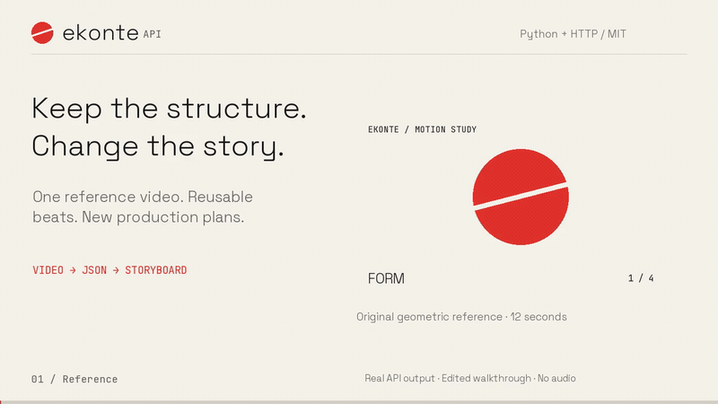

<p align="center">
  <picture>
    <source media="(prefers-color-scheme: dark)" srcset="../assets/ekonte-lockup-dark.svg">
    
  </picture>
</p>

# Ekonte API · 絵コンテ

[English](../../README.md) · [日本語](README.ja.md) · **简体中文**

**提取参考视频的结构，按相同节奏创作新的制作方案。**

[](https://github.com/shiki4709/ekonte-api/actions/workflows/ci.yml)
[](https://github.com/shiki4709/ekonte-api/releases)
[](../../pyproject.toml)
[](../../LICENSE)

Ekonte从短视频中提取带时间信息的节拍，将语音分配到对应区间，并附上镜头标签和旁白数量上限。保存一次JSON，就能生成不同的分镜制作方案，无需重新处理参考视频。

适合开发创意研究工具、视频编辑器和制作工作流的开发者。项目从Ekonte分镜应用中提取而来，**v0.1是面向开发者的实验性版本**。

[演示](#演示) · [快速开始](#快速开始) · [HTTP API](#http-api) · [相关项目](#与相关项目的区别) · [参与贡献](../../CONTRIBUTING.md)

## 演示

[](https://github.com/shiki4709/ekonte-api/blob/main/docs/assets/ekonte-demo.mp4)

**[观看36秒完整演示](https://github.com/shiki4709/ekonte-api/blob/main/docs/assets/ekonte-demo.mp4)** · [静态预览](../assets/demo-poster.png) · [字幕与文字稿](../demo.md#captions-and-transcript) · [查看实际输出](../demo-data)

将原创的12秒动态示例拆成四个节拍，再将同一分析结果用于两份创作要求。给无旁白节拍添加台词后，确定性校验器会检测到违规。这是对真实API输出的剪辑可视化，并非实时录屏。视频无音轨，画面说明为英文，另附英文、日文和简体中文字幕文件。

## 主要特点

- **结构可以成为下一次创作的输入。** 时间、镜头类型、角度和节拍功能以明确字段传递到新方案。
- **无旁白也是约束。** sensory和spectacle分类策略会给部分节拍分配零旁白上限。生成和单节拍重写都会将对应的`line`设为`null`。
- **节奏可以检查。** 有语音数据时，依据参考视频的语速计算上限。无需模型的校验器会检查超限、结构变化、缺失和重复节拍，包括最后一个节拍。
- **固定机位也有替代分段方案。** 硬切较少时，可使用画面元素变化或插值估计的句子边界。
- **未知就返回未知。** 缺少转录不等于没有语音。模型标签和估算的词语对齐都有明确标记。
- **按需安装。** 核心包与FFmpeg即可离线提取；HTTP服务、Gemini、PySceneDetect和社交平台下载器均为可选功能。

这是制作规划工具，不渲染成片，也不预测爆款或留存表现。

## 快速开始

需要Python 3.11及以上版本，以及FFmpeg／ffprobe。

```bash
# macOS: brew install ffmpeg
# Ubuntu/Debian: sudo apt-get install ffmpeg

git clone https://github.com/shiki4709/ekonte-api.git
cd ekonte-api
python -m venv .venv
source .venv/bin/activate
pip install -e '.[api,gemini]'

python examples/make_demo.py /tmp/ekonte-demo.mp4
ekonte analyze /tmp/ekonte-demo.mp4 --offline -o analysis.json
```

离线模式提取时间信息和可选关键帧，不生成语义标签或转录音频。只需核心功能时使用`pip install -e .`。此版本从GitHub安装，尚未发布到PyPI。

## 分析一次，生成多个方案

```bash
export GOOGLE_API_KEY='your-key'
ekonte analyze reference.mp4 -o analysis.json

ekonte storyboard analysis.json --brief 'Show how our ceramic cup is made.' -o cup.json
ekonte storyboard analysis.json --brief 'Show the texture of our handmade soap.' -o soap.json
```

在线分析会把提取的音频和关键帧发送给Gemini，生成时则发送创作要求及分析文本，费用由你的服务商账户承担。离线分析和节奏校验不会调用模型。默认模型是`gemini-2.5-flash`，可通过`EKONTE_MODEL`修改；替代模型必须支持当前适配器使用的JSON Schema和配置。

```python
from ekonte import analyze, storyboard, StoryboardRequest, validate_pacing
from ekonte.providers import GeminiProvider

provider = GeminiProvider()
analysis = analyze('reference.mp4', provider=provider)
plan = storyboard(
    StoryboardRequest(analysis=analysis, brief='Show how our ceramic cup is made.'),
    provider=provider,
)
print(plan.model_dump_json(indent=2))
print(validate_pacing(analysis, plan.beats))
```

若使用自己的带时间戳转录，先`from ekonte import Segment`，再传入`transcript=[Segment(start=0, end=2, text='...')]`。仅在确认没有语音时传入`[]`。`include_keyframes=True`可返回base64 JPEG。自定义模型适配器需实现`complete(prompt, media, schema)`；目前只内置Gemini。

## HTTP API

```bash
export EKONTE_API_KEY='choose-a-long-random-token'
ekonte serve

curl -X POST 'http://127.0.0.1:8421/v1/analyses?offline=true' \
  -H "Authorization: Bearer $EKONTE_API_KEY" \
  -H 'Content-Type: application/octet-stream' \
  --data-binary @/tmp/ekonte-demo.mp4

curl -H "Authorization: Bearer $EKONTE_API_KEY" \
  http://127.0.0.1:8421/v1/jobs/REPLACE_WITH_JOB_ID
```

发送视频原始字节，**不是multipart表单**。本地交互式API文档位于`http://127.0.0.1:8421/docs`，OpenAPI位于`/openapi.json`。轮询`state`直到`succeeded`或`failed`，结果在`result`中。任务结果保留24小时，过期后返回404。

| 端点 | 输入 | 输出 |
|---|---|---|
| `POST /v1/analyses` | 视频原始字节；支持`offline`、`include_keyframes`参数 | 202及任务信息 |
| `GET /v1/jobs/{id}` | 任务ID | 状态、处理阶段、结果／错误 |
| `POST /v1/storyboards` | `{analysis, brief, creator_mode}` | 202及任务信息 |
| `POST /v1/storyboards/beat/rewrite` | `{analysis, brief, creator_mode, storyboard, beat_id}` | 202及任务信息 |
| `POST /v1/pacing/validate` | `{analysis, beats}` | `{valid, violations}`，无需模型 |

新方案请求中的`analysis`应是已完成分析任务的`result`，而非整个任务外层对象。参见[可运行的HTTP示例](../../examples/http_workflow.py)和[Schema说明（英文）](../schema.md)。

## 与相关项目的区别

以下比较基于2026年9月14日阅读的公开README，比较的是工作流范围，不是质量基准测试。

| 项目 | 文档中的主要用途 | Ekonte的重点 |
|---|---|---|
| [PySceneDetect](https://github.com/Breakthrough/PySceneDetect) | 镜头切换检测和分割 | 在检测基础上增加转录对齐和制作约束；可将其作为可选依赖 |
| [BrightWayAI/video-analyzer](https://github.com/BrightWayAI/video-analyzer) | 帧分析、转录、风格指纹、分镜拆解和MCP | 最接近的项目。Ekonte重点是将结构用于新的创作要求，并提供逐节拍旁白上限和独立校验器 |
| [VideoDB Director](https://github.com/video-db/Director) | 基于VideoDB的视频搜索、编辑、生成和流媒体智能体 | 小型本地Python库和可选HTTP API，面向参考视频到制作计划的流程 |
| [AI-storyboard-generator](https://github.com/dseditor/AI-storyboard-generator) | 从初始图片和故事大纲生成分镜及视频 | 从已有视频提取时间与镜头结构，再生成新的文字制作方案 |

[详细比较（英文）](../comparison.md)。不声称功能独有，也不声称输出质量优于其他项目。

## 部署与限制

```bash
docker build -t ekonte-api .
docker run --rm -p 127.0.0.1:8421:8421 \
  -e GOOGLE_API_KEY -e EKONTE_API_KEY \
  -v ekonte-data:/data ekonte-api
```

- 每个数据目录只运行一个服务进程：两个工作线程，最多接纳八个任务／上传。队列满时返回429。SQLite保留已完成结果，重启后仍可读取；中断任务标记为失败，不自动重试。
- 输入上限为180秒、100 MiB、3840×2160；最多输出60个节拍。JSON请求体上限为2 MiB。单次FFmpeg执行和模型请求均有超时限制。
- 原始上传在处理后删除，重启时清理遗留上传文件。结果中的转录、画面文字和可选关键帧可能保留到过期。过期处理是删除数据库行，不是安全擦除磁盘。
- 面向可信用户／团队。一个Bearer令牌可访问全部任务，没有逐用户隔离。远程使用时需配置HTTPS和带请求／上传超时的反向代理。CLI绑定非回环地址时要求设置`EKONTE_API_KEY`。FFmpeg处理不是面向恶意媒体的强化沙箱。
- 标签、句子边界、语速和视频类型启发式仍需真实视频评估。数量计算按空白分词，主要适用于英语等以空格分词的语言。**中文文档不代表中文旁白长度控制已得到验证。** 目前没有强制对齐或留存表现基准测试。
- 生成会固定结构字段并保留无旁白约束，尝试一次节奏修复，再报告剩余违规。不保证事实正确性或原创性，制作前应人工审核。

安装`pip install -e '.[scenes]'`可启用PySceneDetect；未安装时使用FFmpeg。安装`pip install -e '.[download]'`后，CLI支持TikTok／Instagram的HTTPS链接。URL下载只在CLI／Python适配器中提供，HTTP API不接受URL。请使用有权处理的视频，并留意来源平台的限制。

## 开发与文档

```bash
pip install -e '.[api,gemini,dev]'
pytest -q
ruff check src tests examples
python -m build
```

测试使用合成视频和测试适配器，不需要API密钥或付费服务。

[贡献指南](../../CONTRIBUTING.md) · [故障排查](../troubleshooting.md) · [路线图](../../ROADMAP.md) · [更新日志](../../CHANGELOG.md) · [安全政策](../../SECURITY.md) · [社区准则](../../CODE_OF_CONDUCT.md)

项目采用MIT许可证。FFmpeg、可选依赖、源视频及字体仍遵循各自许可证。参见[素材来源](../assets/README.md)。

---

翻译基于英文README，API版本v0.1.0，更新于2026年9月14日。[英文版](../../README.md)是规范参考，部分链接的技术文档目前仅有英文。欢迎修正和完善翻译。
